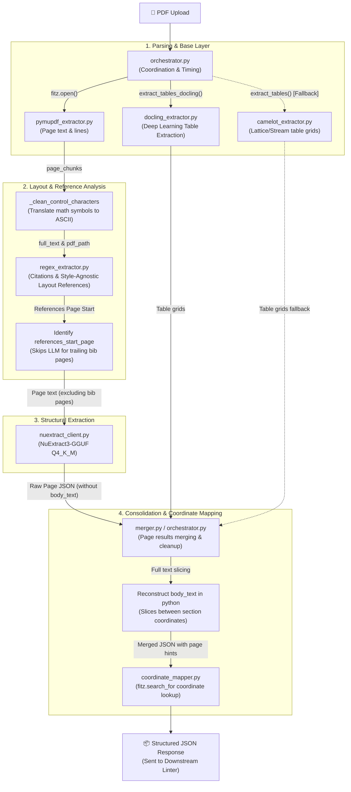

# ReportGPS — Hybrid Extraction Pipeline Architecture

A local, high-fidelity, offline hybrid extraction microservice (`services/extraction-pipeline/` running on port `8004`) that coordinates PyMuPDF, NuExtract3 (via local `llama.cpp`), Camelot, and IBM Docling to extract highly structured academic paper schemas.

---

## Technical Architecture

---

## High-Fidelity Pipeline Stages

### Stage 1: Base Layer (PyMuPDF, IBM Docling, & Camelot)
1. **PyMuPDF Extraction**: Extracts page plain text and structures lines/spans (capturing coordinates, font size, bold/italic).
2. **Deep-Learning Table Extraction**: Prioritizes **IBM Docling** to extract structured tables. Docling applies layout object detection (YOLOv8-based) and a transformer-based cells parser (`TableFormer`) to extract borderless academic tables and align exponents without manual tuning.
3. **Camelot Fallback**: If Docling is unavailable, the pipeline falls back to **Camelot** (lattice/stream heuristics) with tuned row/column tolerances (`row_tol=6`, `column_tol=2`).

### Stage 2: Layout & Bibliography Analysis
1. **PDF Control Character Translation**: Maps mathematical control codes (e.g. `\x04`, `\x02`) to standard ASCII symbols.
2. **Style-Agnostic Layout Reference Extraction (`_extract_references_layout`)**:
   - Locates references page start using text headers.
   - Extracts page text lines with bounding-box coordinates, sorting them correctly for two-column layouts.
   - Automatically detects the citation style (`numbered-bracket`, `dot-number`, or `apa-style`).
   - Groups multi-line references based on indentation and margins, and splits column-merged blocks.
   - Discards page numbers and running headers/footers based on vertical block dimensions and positions.
3. **LLM Reference Skipping**: Computes the first references page number and completely bypasses NuExtract LLM calls on all pages after it, saving latency and preventing output token limit errors.

### Stage 3: LLM Parsing (NuExtract3)
1. **Dynamic Metadata Page Detection**: Scans first 5 pages for `\babstract\b` to run the metadata schema on the actual title/abstract page (bypassing cover sheets).
2. **Body Extraction (No Body Text)**: Extracts section subheadings, equations, table/figure captions, and acronyms page-by-page. *Note: `body_text` is excluded from the schema to prevent NuExtract output truncation.*

### Stage 4: Consolidation & Slicing
1. **Zero-Truncation Body Slicing**: Dynamically maps heading text to their exact character coordinates in `full_text` and slices the body text between headings in Python, ensuring 100% text accuracy at zero token cost. The pattern matches whitespaces and ASCII control characters (`[\s\x00-\x1f]+`), preventing matching failures due to PDF rendering artifacts (e.g., `\x07` BEL character).
2. **Coordinate Pinning**: Searches for headings, caption labels, acronyms, and equations using multi-tier page lookup, returning absolute bounding boxes to the UI.
